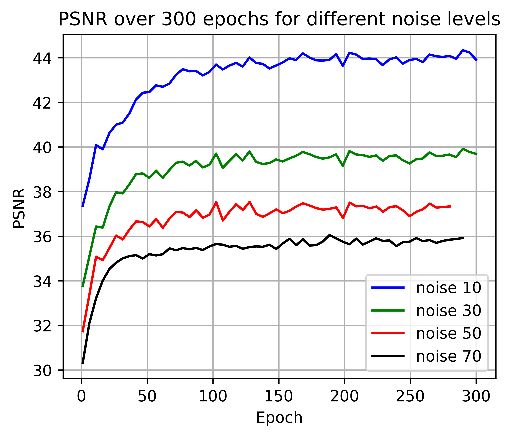
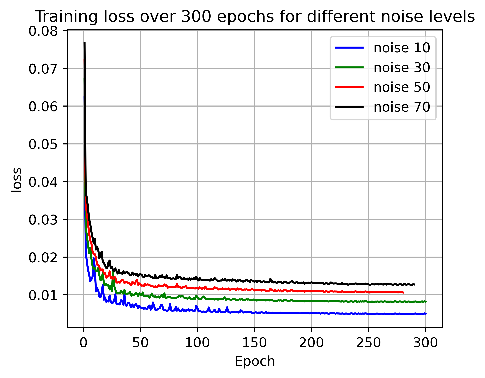
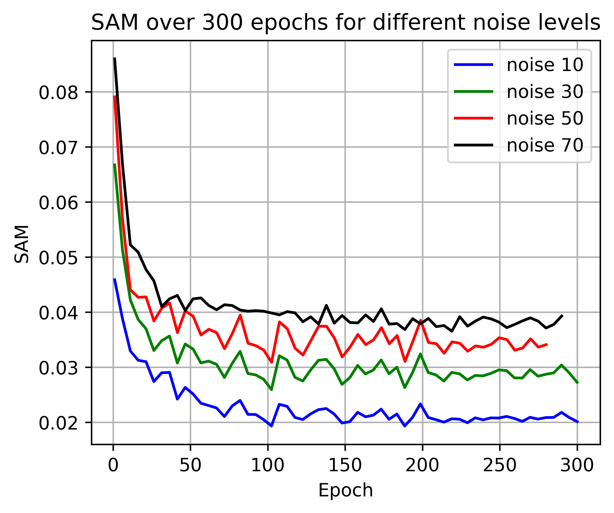
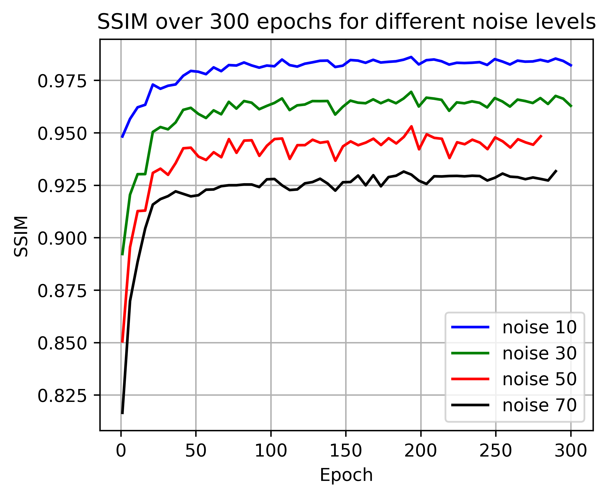

# An Adaptive Spatial-Spectral Model for Denoising Hyperspectral Images
### Both training and testing codes are in _v15_final

## The architecture

## Results
### The Loss curve

### Progression of image quality
#### Peak-to-peak Signal Ratio (PSNR)

#### Spectral Angle Mapper (SAM)

#### Structural Similiarity Index Measure

